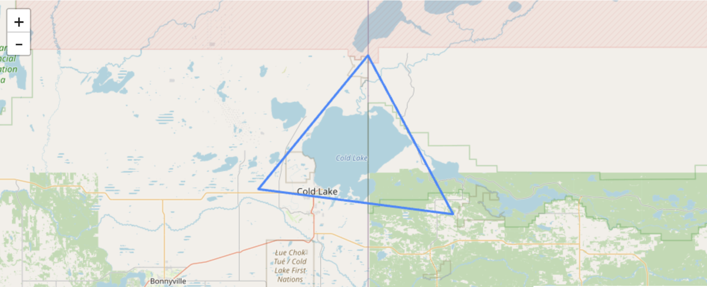

# Vector ⥂

> "Vector! That's me, 'cause I'm committing crimes with both direction and magnitude. Oh, yeah!" — "Vector", [Despicable Me](https://en.wikipedia.org/wiki/Despicable_Me)

_Vector_ is a **catalog for vector data**. It enables users to store, query, and display vector data — which includes everything from fault lines to thermal anomalies to material spectra.

Formal documentation for this library is available under the [Descartes Labs API Documentation](https://docs.descarteslabs.com/api.html). Below is a very simple example to get you started with uploading and querying data to and from Vector.

To start using the Vector client, first import it:

```python
import descarteslabs.vector
```

Next, we can create a vector product by executing the following Python code:

```python
product = vector.Table.create(
  "my-favourite-shapes", # ID for the table
  "My favourite shapes"  # Name for the table
)
```

This product will contain only the most appealing shapes. Products consist of features, which themselves consist of a geometry and properties. Features are encoded as GeoJSON.

Let's create a feature that contains a triangle geometry, and give it a name by adding a property:

```python
import json

geojson = {
  "type": "FeatureCollection",
  "features": [
    {
      "type": "Feature",
      "properties": {
        "name": "The coldest lake"
      },
      "geometry": {
        "coordinates": [
          [
            [
              -110.40972704675957,
              54.464841702835145
            ],
            [
              -109.69305293767921,
              54.41100418392534
            ],
            [
              -110.00659786040178,
              54.75020711805794
            ],
            [
              -110.40972704675957,
              54.464841702835145
            ]
          ]
        ],
        "type": "Polygon"
      }
    }
  ]
}
```

...and then add it to the product we just created by executing the following Python code:

```python
product.add(feature_collection)
```

We can retrieve this feature by querying the product in a few different ways. First, by its name:

```python
p = vector.property_filtering.Properties()
product.query(
    property_filter=(p.name == "The coldest lake"),
)
```

...and second, by an AOI which intersects with the geometry of our feature. The AOI is defined as a GeoJSON geometry:

```python
# Define the AOI...
aoi = {
  "coordinates": [
    [
      [
        -110.7588318166646,
        54.941440389459956
      ],
      [
        -110.7588318166646,
        54.14613049153121
      ],
      [
        -109.34594259898329,
        54.14613049153121
      ],
      [
        -109.34594259898329,
        54.941440389459956
      ],
      [
        -110.7588318166646,
        54.941440389459956
      ]
    ]
  ],
  "type": "Polygon"
}

# ...and query the product
product.query(
    aoi=aoi,
)
```

Since, in this case, our feature has a geometry, we can also visualise it on a map! Let's do this now, using `ipyleaflet`:

```python
import ipyleaflet

# Instantiate and configure the ipyleaflet Map
m = ipyleaflet.Map()
m.center = 54.549829, -110.060936
m.zoom = 9

# Display the map
display(m)

# Visualize the vector tile layer on the map
product.visualize("My favourite shapes", m)
```

Which should yield the feature we just created, outlining the coldest lake on Earth:



The Vector service also provides for more advanced product and feature management and querying. You can read more about what can be done with Vector in the [Descartes Labs API Documentation](https://docs.descarteslabs.com/api.html).
